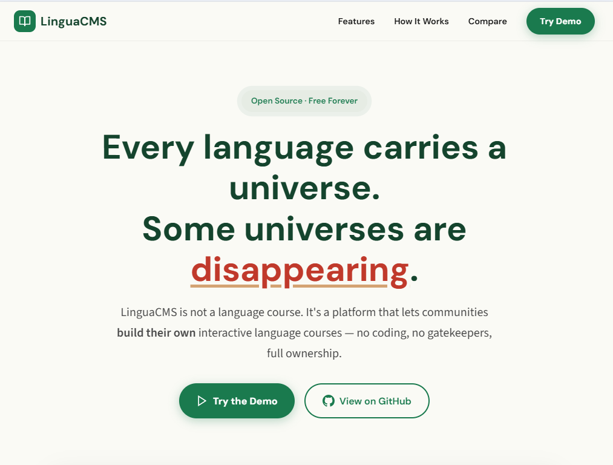
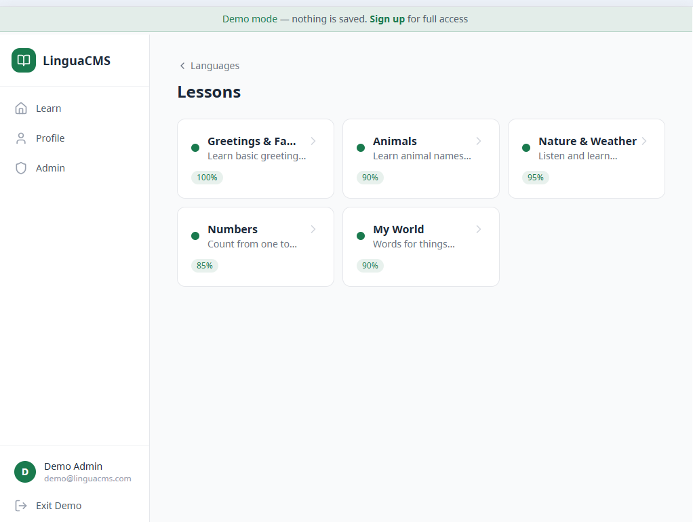
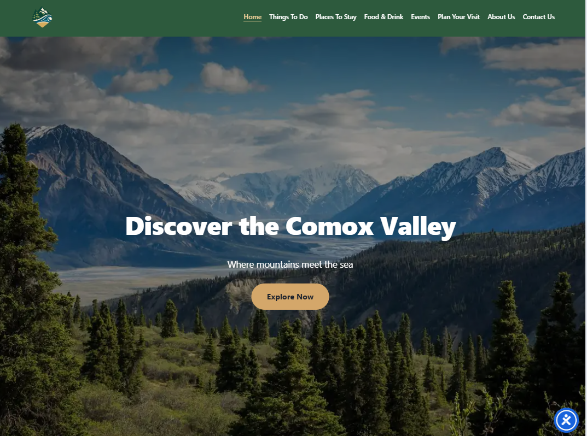

# Oleg Medvedev

Full-stack developer in Canada. Twelve years of professional software work, most of it
on enterprise business systems, now building web applications and AI-assisted tooling.
Authorized to work full-time in Canada, open to relocation anywhere in the country and
to remote work across Canadian time zones.

C# / .NET · React · Angular · TypeScript · PostgreSQL · SQL Server · Docker
Claude Code and Model Context Protocol servers in daily use.

---

## LinguaCMS

An open-source platform that lets language communities build their own interactive
courses. It was built for endangered languages, where there is no commercial incentive
for anyone to make a Duolingo course, so the community has to be able to make it itself.

**[Product site](https://landing.linguacms.twilightparadox.com/)** ·
**[Live demo](https://linguacms.twilightparadox.com/)** ·
**[Source](https://github.com/olegmedv/lingua-ms)** ·
**[Featured by North Island College](https://learndigital.dev/students/oleg-medvedev/)**

> ### The demo needs no account
> Open the [live demo](https://linguacms.twilightparadox.com/) and press the
> **Try Demo** button under the login form. No sign-up, no email, no password.
> It drops you straight into a working dashboard with two courses loaded, including
> a real ʔayʔaǰuθəm course with content sourced from FirstVoices.

What is in it:

- Eight interactive exercise types with audio from fluent speakers: multiple choice,
  listen and select, listen and type, match pairs, image select, word bank,
  fill in the blank, flashcards
- A no-code course builder, so a teacher can create lessons without writing anything
- Progress tracking, streaks, spaced repetition and automatic lesson unlocking
- An admin area for managing languages, courses, lessons and exercises

Stack: React 19 and TypeScript on the front end, .NET 9 REST API built on a CQRS
pattern, PostgreSQL, JWT authentication with role-based access, Docker.
Self-hosted on my own VPS: containers behind nginx with TLS, deployed and maintained
by me rather than pushed to a managed platform.

This was my capstone project at North Island College, and the program published it on
its student showcase:
[learndigital.dev/students/oleg-medvedev](https://learndigital.dev/students/oleg-medvedev/).
The problem it exists for, in one line from that page: *most language learning apps
serve languages with millions of speakers, but over 3,000 endangered languages
worldwide have zero digital learning tools.*

The product site is a separate, hand-written static page with no framework and no
build step. Semantic HTML, responsive layout, scroll-reveal sections and a custom
type scale. The copy, the layout, the comparison table and the demo video are mine.

---

## Explore Comox Valley

A regional tourism site for the Comox Valley on Vancouver Island: Courtenay, Comox
and Cumberland. Six content sections covering things to do, places to stay, food and
drink, events and trip planning.

**[Live site](https://explorecomoxvalley.crabdance.com/)**

The work here is information architecture, content structure and responsive layout
rather than application code: organising a large amount of regional material so a
visitor can find one thing quickly, with optimised images and mobile navigation.
Built on WordPress with a block theme. Independent project, not affiliated with any
tourism authority.

---

## agentic-harness

A self-hosted Model Context Protocol server that exposes CRUD tools over a .NET back
end, together with custom agent skills that plan, critique and execute code changes
under review.

**[Source](https://github.com/olegmedv/agentic-harness)**

I use it every day. The part I care about most is not the model call, it is what
surrounds it: generated output has to be validated before anything downstream depends
on it, and an agent that is confidently wrong costs more than no agent at all. So the
evaluation path and the human review step come first, and the automation comes second.

---

## Background

- Post-Graduate Diploma, Digital Design and Development, North Island College, 2026.
  GPA 4.23 / 4.33, Dean's Honour Roll, Coding Award 2026.
- Five-year Specialist Diploma, Applied Informatics, Kaliningrad State Technical
  University.
- Eight years building and integrating ERP systems for retail, accounting, inventory,
  pharmacy and municipal utility clients, then five years on modern web stacks.

## Contact

[LinkedIn](https://www.linkedin.com/in/oleg-medvedev-canada-bc) ·
oleg.medvedev.ca@gmail.com
